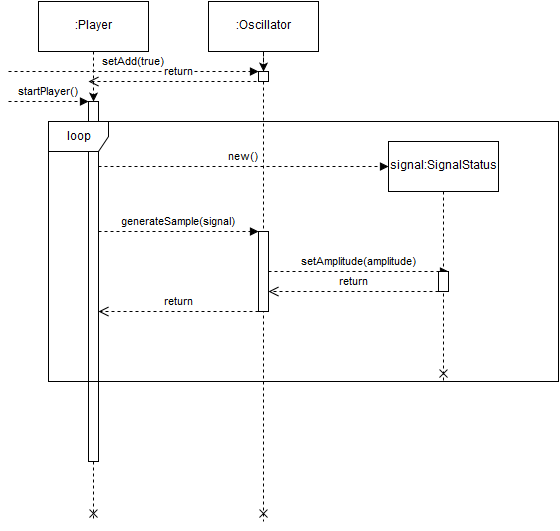

# Projektin kuvaus
**Aihe:** syntetisaattori
Toteutetaan syntetisaattori, jonka avulla käyttäjä voi käyttöliittymän kautta tuottaa ääntä ja muokata syntetisaattorin eri komponenttien parametreja.

Syntetisaattori koostuu erilaisista komponenteista, joihin lukeutuvat mm. oskillaattori, suodatin ja vahvistin. Nämä komponentit muodostavat *signaalipolun*, jossa oskillaattori toimii äänilähteenä ja suodatin ja vahvistin muovaavat oskillaattorin generoimaa aaltomuotoa. Ajallisesti suodattimia ja vahvistimia voidaan hallita ns. *vaipoilla* tai verhokäyrillä.

Projektin laajuus kattaa käyttöliittymän syntetisaattorille, jossa komponentit ovat ennaltamääritellyt, ts. signaalipolku koostuu neljästä oskillaattorista joista jokaisella vahvistin verhokäyrällä varustettuna. Syntetisaattori tukee eri synteesin muotoja, kuten esim:
- (Pseudo)Taajuusmodulaatiosynteesi, jossa oskillaattorit muuntavat lennosta toisten oskillaattoreiden taajuutta.
- Additiivinen synteesi, jossa usean eri oskillaattorin tuottamia aaltomuotoja summataan.
Syntetisaattori tukee myös amplitudimodulaatiota, joskin tämä ei ole yhtä yleinen pohja äänisynteesille kuin yllämainitut.

**Käyttäjät:** Muusikko tai äänisynteesin opiskelija

**Toiminnot:**

- Oskillaattorin virityksen säätö senteillä kuvattuna
- Oskillaattorin eri tilojen kuten taajuus-/amplitudimodulaatio, ohitus ja additio tilojen valitseminen
- Vahvistimen voimakkuuden säätö
- Vaippojen eri toteutusten aikaparametrien säätö

## Luokkakaavio

- Player luokalla on oliomuuttujana SignalSource-interfacen toteuttava olio.
Kun Player käynnistetään, se avaa uuden SwingWorker säikeen joka pyytää SignalSourcen toteuttavalta oliota generoimaan amplitudin luotuun SignalStatus-olioon, joka kirjoitetaan puskuroituna Javan tarjoaman Sound APIn SourceDataLine-olioon.
- SignalStatus olio pitää sisällään tietoa signaalille ominaisesta tiedosta signaalipolussa, kuten amplitudista, kirjoitettavasta taajuudesta, ja aallon vaiheesta.
- Oscillator toteuttaa SignalSource-interfacen, sekä omistaa oliomuuttujana SignalSource-interfacen toteuttavan olion. Oskillaattorit pyytävät SignalSourceaan muuttamaan SignalStatusta, jonka jälkeen ne itse muokkaavat SignalStatusta omien asetuksiensa mukaisesti.
- EnvelopeGenerator oliot toteuttavat metodin generateEnvelope, joka ottaa parametrina SignalStatuksen ja palauttaa amplitudin SignalStatuksen vaiheeseen perustuen. Oscillator käyttää EnvelopeGeneratorilta saatua amplitudia omien parametriensa säätöön.
- ADSR on toteutus EnvelopeGeneratorista, joka pitää sisällään kolme vaihetta joiden sisällä amplitudi generoidaan SignalStatuksen vaiheesta, sekä pysyvän amplituditason, joka säilytetään kahden viimeisen vaiheen välillä.

## Sekvenssikaavio yksi oskillaattoriselle monosyntetisaattorille

